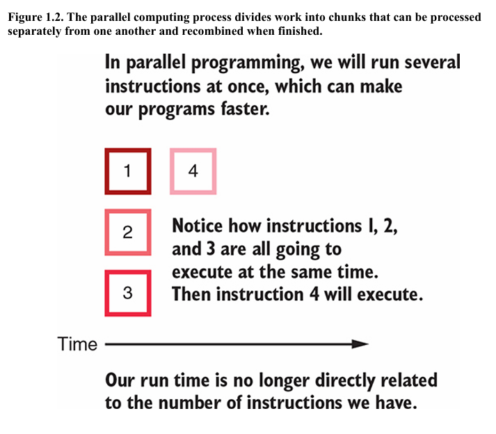

# Chapter-1 : Introduction

What is standard procedural computing(procedural programming) and it's workflow ?

- a sequence of instructions written
- workflow limits us to execute one instruction at a time

1. A program starts to run
2. program issues an instruction
3. that instruction is executed
4. step 2 and  3 are repeated
5. the program finishes running

- if step 2 take a long time to execute then we won't be able to move on to the next step of the problem.

What is parallel computing(parallel programming or parallelization) ?

- a way to make our computer run multiple task at once
- allows to execute all of these similar and independent steps simultaneously.

1. program starts to run
2. program divides up the work into chunks of instructions and data
3. each chunk of work is executed independently
4. program finishes running

- we are free from the instruction execution loop by spliting our work into many chunks
- but we need enough computing resources to process all of the chunks, every time they aquire a new machine they make thier process that much faster.

Scalable computing with map and reduce style, can be done in context of both size of data and capacity of the computing resources available to us.

- normal size data, we can use the personal computer-scale to store and process the data.
  
- as size of data changes from small to the largest, we have trouble in storing data on personal computers
- Distributed computing framework such as Hadoop, Spark, Splunk, Elasticsearch, Pig and Hiv
- How to deploy these services on the cloud such as Azure, Google and AWS
