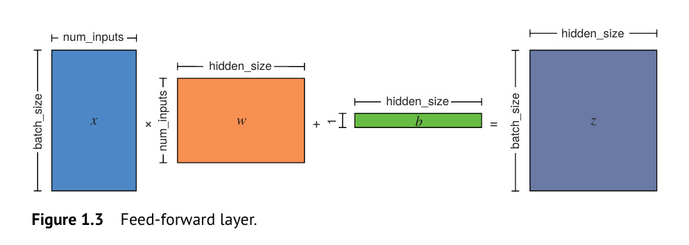

# CS-1 Dense Layer of a Neural Network

What is Vectorization ?

A key skill for efficient implementation of the ml algorithms and dl architectures.

Neural Networks consists of Feed Forward Layers like Dense, Linear, Perceptron, Hidden Layers etc. But all of them has a commond mathematical formulation

$$
h = \sigma(wx + b)
$$

where $y = xw + b$ is a linear model but it can by any according to our data modelling hypothesis.

x - input of shape : (batch_size, number_of_inputs)

w - parameter matrix(kernel) of shape : (number_of_inputs, hidden_size)

b - bias parameter vector of shape : (1, hidden_size)

$\sigma$ - activation function : relu, sigmoid or tanh etc are applied to every results of linear operation for nonlinearity.

z - output of shape : (batch_size, hidden_size)

Matrix form

$$
Z=σ(XW+b)
$$

where

* $(X): (N, d)$ — batch size (N), input features (d)
* $(W): (d, h)$ — (h) hidden units
* $(b): (h,)$ — one bias per hidden unit
* Output $(Z): (N, h)$ — batch size (N), hidden units (h)

How to create a multilayer perceptron architecture ?

Stacking the above created multiple FNN we can create a multi-layer parceptron but we needed to adjust the inputs and outputs from layers to layers.

Practical : Implementation of the MLP itself using for loop needed to run the millions of iteration on th batch_size, number_of_inputs and hidden_size. Ex-1 : GPT(LLM) has hundreds of billions of parameters make infeasible to train the model and even perform inferencing using naive for-loop approach.

Thus, we take vectorization approach for implementation on CPU/GPU provides significant speedup in performance of model. There are certain operations like matrix multiplication requires special algorithms like Strassen's Algorithms or AlphaTensor etc and implementation of them onto the CPU/GPU devices is not a trivial task therefore we use the existing state-of-art libraries. These pre-existing libraries also uses the vectorization, we needed to adept them in our thinking in terms of vectorization.

1. Sigmoid Activation Function
2. Linear Operation
   - @ operator from vector/tensor libraries like numpy, torch or tensorflow for matrix multiplication operation.
   - How can a vector be added to a matrix ? -> Concept of broadcasting.
3. Nonlinear Operation : element-wise operation.

Hence - Vectorization simplifies the efficient representation of the neural networks operating on high-dimentional arrays/tensors with large number of data points.