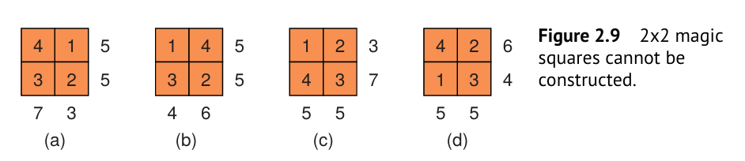
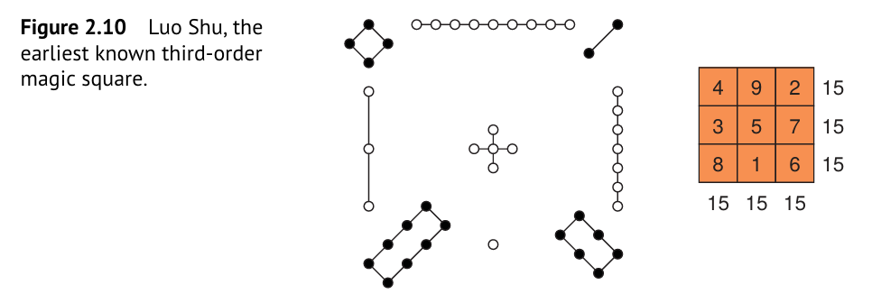
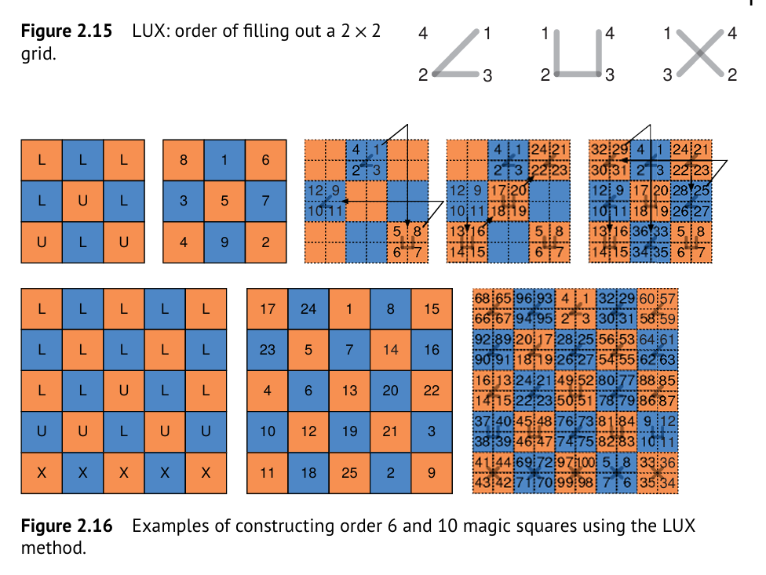

# CS2-Vectorization Operations : 

### 1. Image Normalization

How to transform scalar to tensor ?

Scalar to tensor broadcasting is just the min-max normalization of the data.

Ex-1 : Given an image $I$ Then

$$
Norm(I_i)=\frac{I_i - min(I)}{max(I) - min(I)} \; \forall i
$$

be the index of the image pixels.

For a batch of images we can use the vector broadcasting.

### 2. Pearson's Correlation

It measures the linear relationship between two variable $X$ and $Y$ and defined as 

$$
r = \frac{Cov(X, y)}{\sigma(X) \sigma(Y)}
$$

### 3. Pair-wise Differences

### 4. Construction of Magic Squares

What is magic square ?

It is a square matrix of size $n \times n$ with entries values between $[1, n^2]$ such that each row, column, and the main diagonal have identical sums. 

Ex-1 : Given square matrix of size $2 \times 2$ impossible to construct a  magic square.

Ex-2 : The earliest known third order magic square

#### 4.3 Odd-Order Magic Squares Construction by Siamese Method

#### 4.2 Doubly-Even Order Magic Squares

#### 4.1 Singly even order magic squares

We will use the “LUX” method by John Horton Conway [Erickson,2009;Weisstein, 2023]. Its implementation in numpy shows the efficiency of the numpy for handling complex data manipulations.

