# Ch02 - Basic Tensor Operations

Python libraries like NumPy, TensorFlow and PyTorch implements many types of vectorization operation for scientific computing.

Scalar - A variable of zero dimensions and represents a single numerical value.

Vector/Array - Variable of one dimension and represents a list of values

Matrix - Variable of two dimension and represent a rectangular matrix

Tensor - Variable is a generic collection of values of n-dimensions. For n>2 we use the term tensor  to indicate high-dimensional collection of values.

### Tensor Initializers

A way to pre-allocate the some spaces in memory to store values to be filled in later on.

It used for masking and indexing operations.

Question - Why pre-allocation or initialize a vector at all ?

Performance - Extending an array on the fly is more costly than pre-allocating a protion of memory for our computations.

Software Development - pre-allocation is an effective
 strategy for better performance when dealing with large arrays in many other languages.

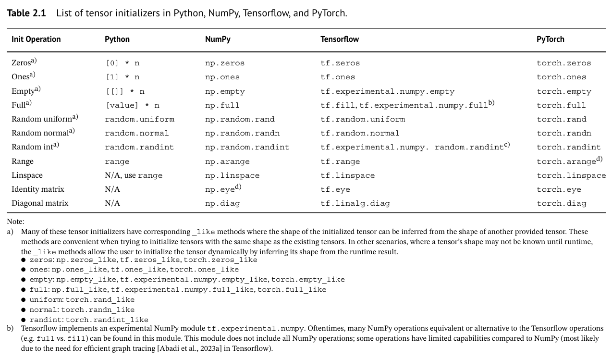

A list of tensor initializers in Python, NumPy, TensorFlow, PyTorch. Most of the initializers are similar and required shape and opt dtype as arguments to construct tensor. There are few basic categories

1. Static value initializers
2. Random value initializers
3. Range Value initializers
4. Special matrix initializers

### 2. Data Type and Casting

In any applications, we needed to manipulate the underlying data stored in the tensor.

How a computer represents information at the fundamental level ?

The value of data may be represent info differently on machines. For any language to use to represent data, we needed to first understand its computational supported data types.

Python is not strongly typed language unlike C. But a good understanding of fundamental data types within
 the libraries like NumPy, PyTorch and TensorFlow can help to call methods and functions that efficiently implements algorithms that are optimized for certain datatypes.

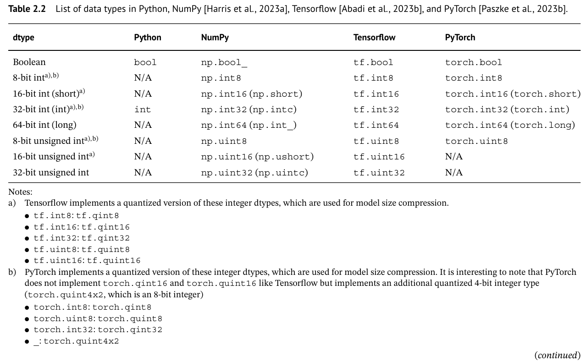

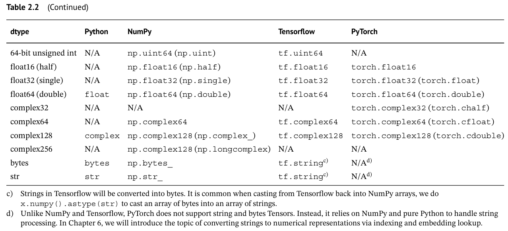

### Mathematical Operations

The Scientific Computing Libraries build in Python/MatLab for purpose of doing mathematical operation onto the tensor values.

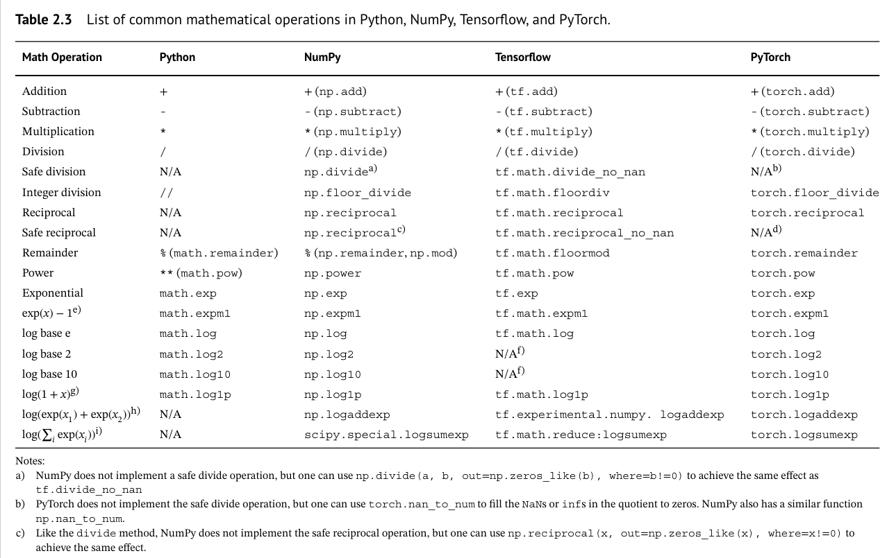

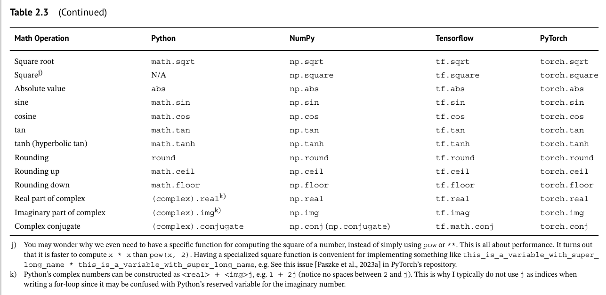

### Reduction Operations

These are mathematical operations that reduce the set of values into a single value means it reduces the size of tensor from the higher dimension to the lower dimension like scalar.

### Value Comparision Operations

It compare the value stored within the tensor.

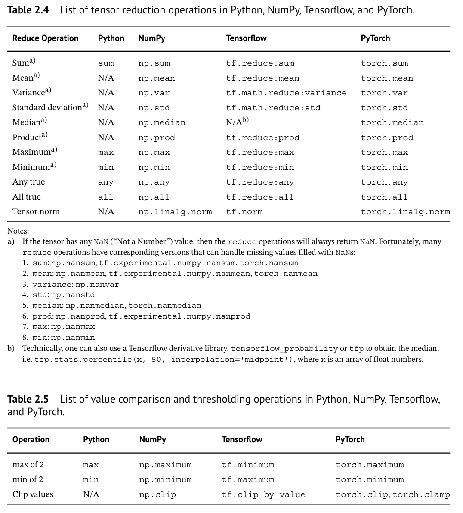

### Logical Operations

It is also known as boolean operations where operators like OR, AND, NOT and XOR are computed.

### Orderd Array- Adjacent Element Operations

It perform computations between consecutive elements like commulative and difference operations.

### Array Reversing

It reverse the array or tensors along a certain dimension

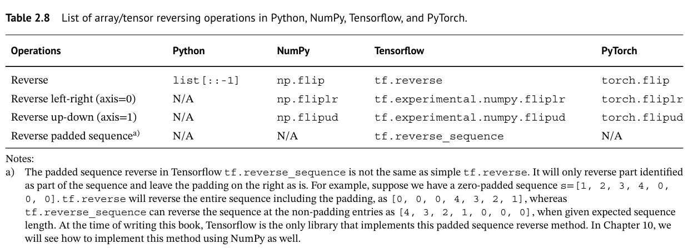

### Concatenation, Stacking and Splitting

Tensors can be constructed by combining with other tensors or by splitting larger tensors into smaller tensors.

#### Reshaping

Reshaping operations keep the underlying data of the tensor identical to the inputs but represent the tensor in a different format. Being able to trace the evolution of the tensor shapes through a computational graph is probably one of the most important skills to master before being able to successfully implement a deep learning algorithm. Oftentimes, the outputs of a previous operation may not be directly usable in the subsequent operations.

Ex-1 : A feed-forward layer may output an array of 9 elements, but the subsequent operation requires us to take an average of 3 groups of 3 elements. One way we can implement this is by reshaping the 1D array of 9 elements into a two-dimensional, 3 × 3 matrix, then taking the mean by each row.

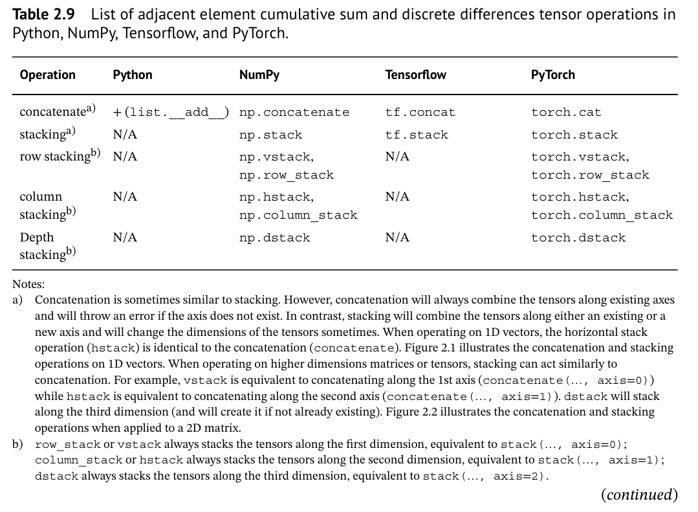

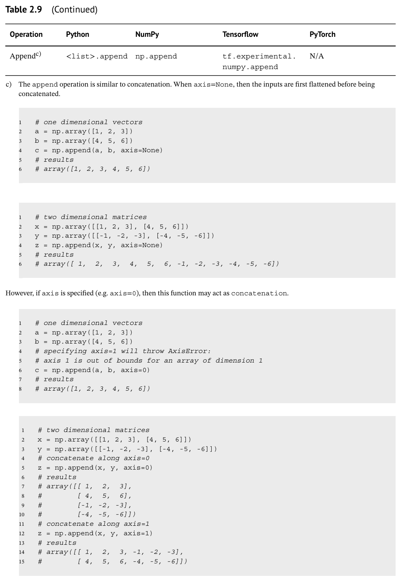

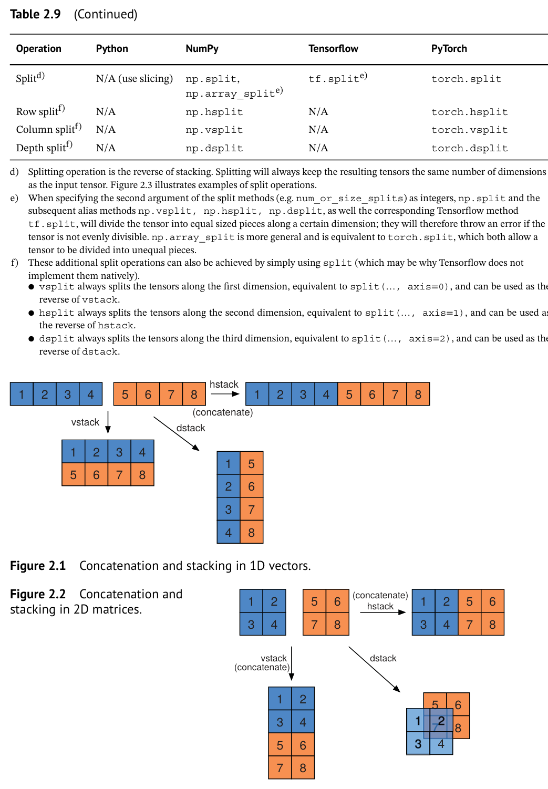

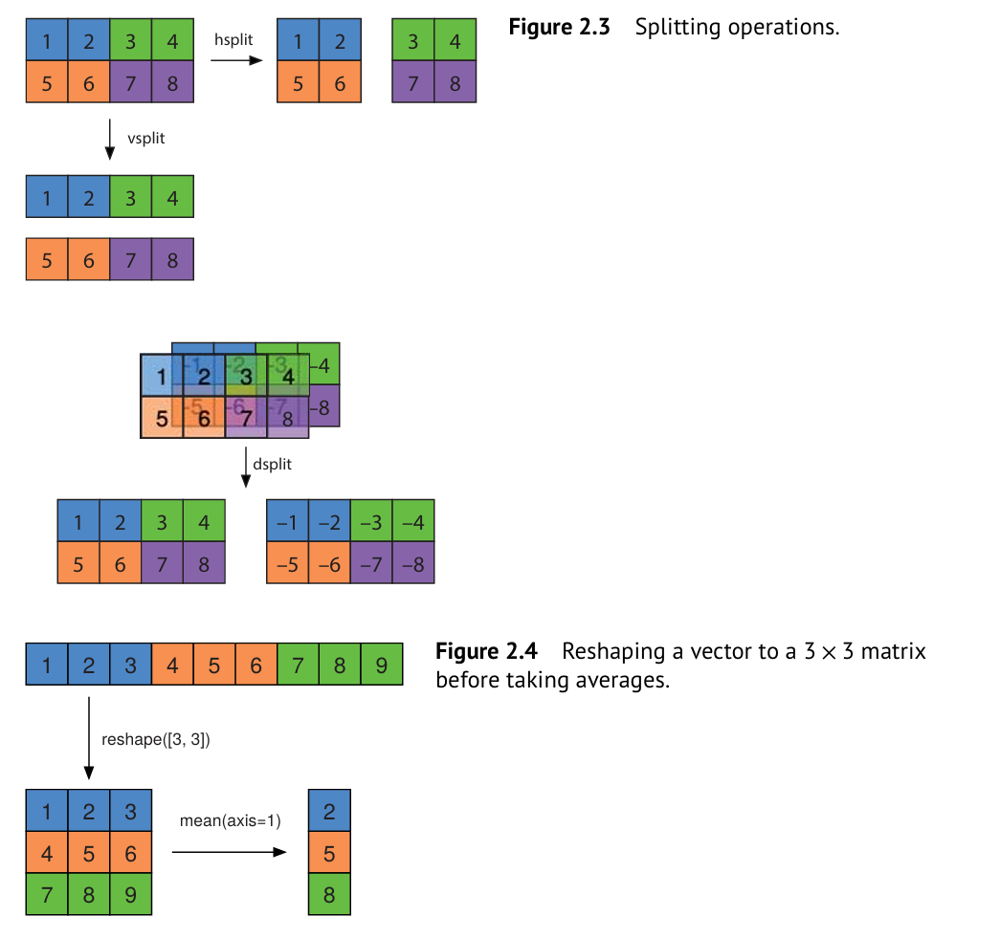

#### Broadcasting

What is broadcasting ?

An element-wise operation on a pair of tensors of different dimensions. The tensor of lower-dimension is as if they repeated many to match the higher dimension tensor. 

Ex-1 : Assume that scalar of 0-dim tensor and vector 1-dim tensor can be added togather via broadcasting.

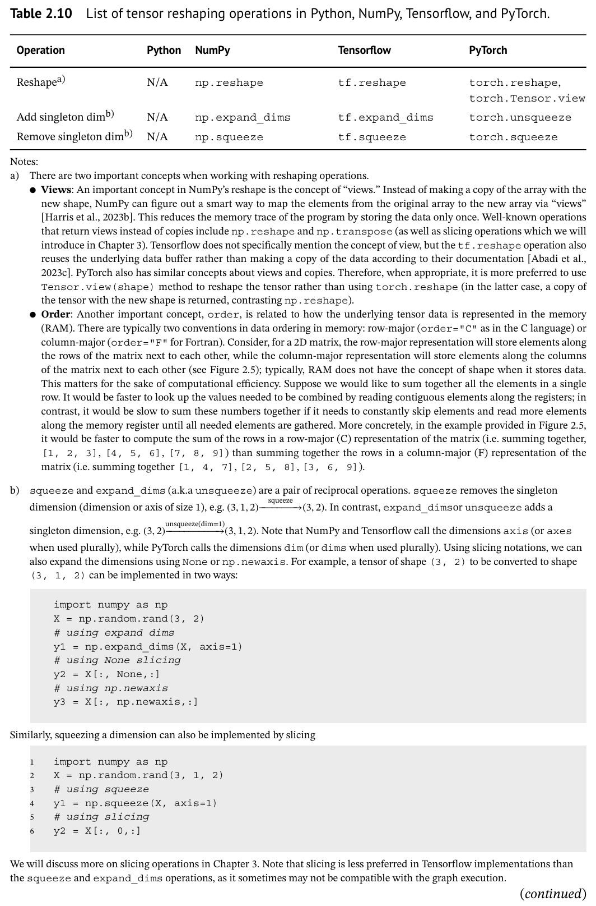

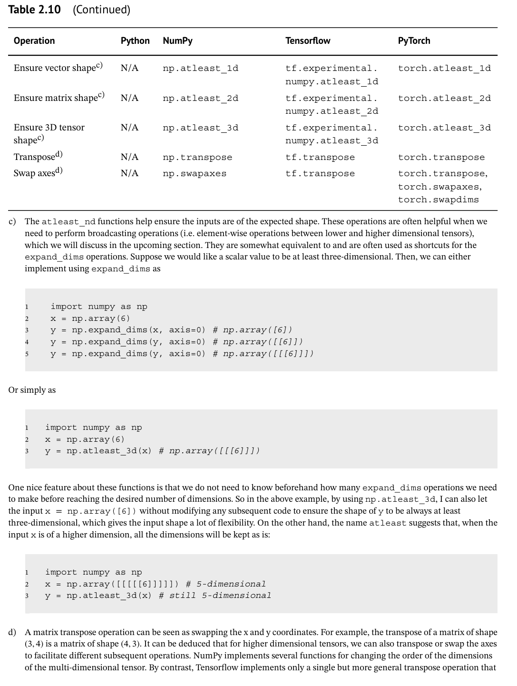

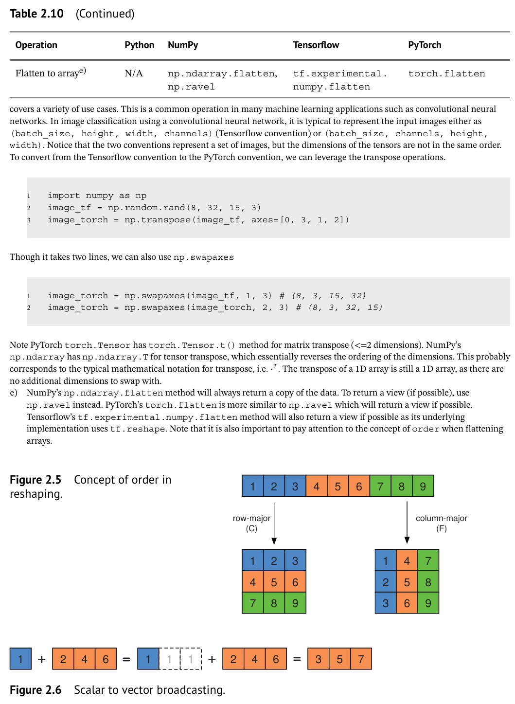

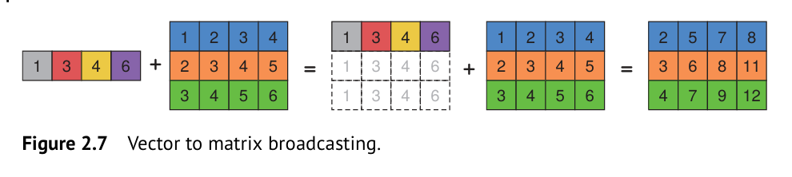

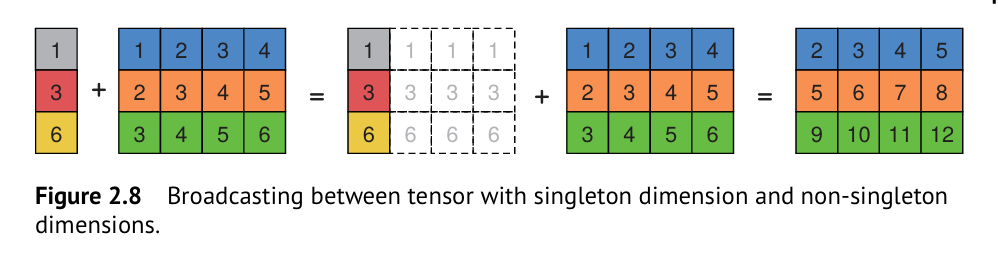

## Conclusion
